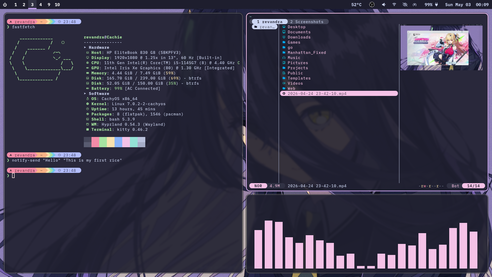
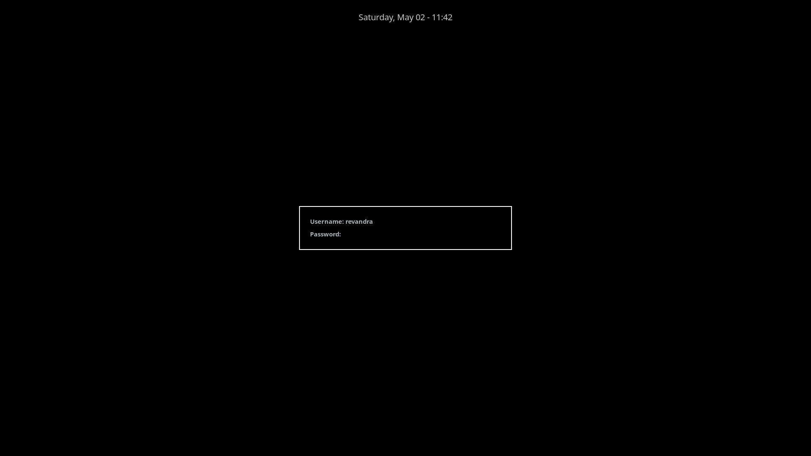

  <h1>Rev-dotfiles</h1>
  
Don't forget to backup first and use at your own risk!!

## Preview
- Desktop

- Hyprlock

> [!WARNING]
> My dotfiles are **laptop specific**. Despite trying to make a flexible installation script, some of the things might not work! You better install everything manually based on your needs, or use this repository as an inspiration.

## Dependencies
- Hyprland
- Hyprpaper
- Hyprlock
- Hypridle
- Bash
- Kitty
- Starship
- Waybar
- Rofi
- Dunst
- Clipse

## Installation
Just clone this repository and move the files to its designated place. 
`git clone https://github.com/RevVans/Rev-dotfiles.git`

## Wallpaper Source
https://www.pixiv.net/en/artworks/100277012